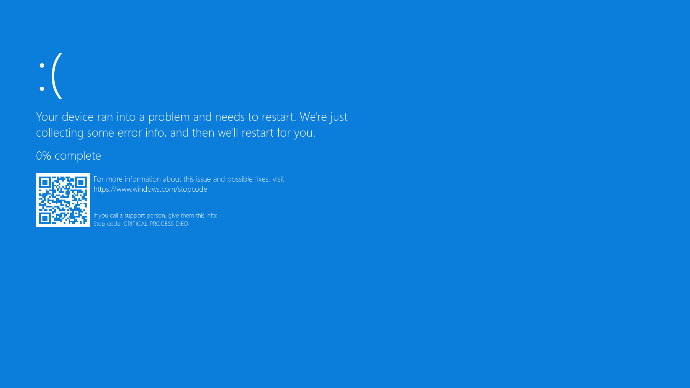

# BSOD Prank - April Fools 2025🎉

# How to use?
1. [Download Python](https://www.python.org/downloads/) 3.x version (try to get the latest one).
2. Install required libraries by running `py -m pip install -r requirements.txt`.
3. If successful, you can edit your own BSOD display settings from the bsod.py source code
   (description provided).
4. Test the script by running `py bsod.py` in your terminal.
5. Now try to prank your friends by running `py bsod.py` in your terminal.